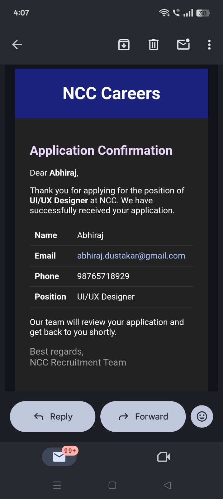
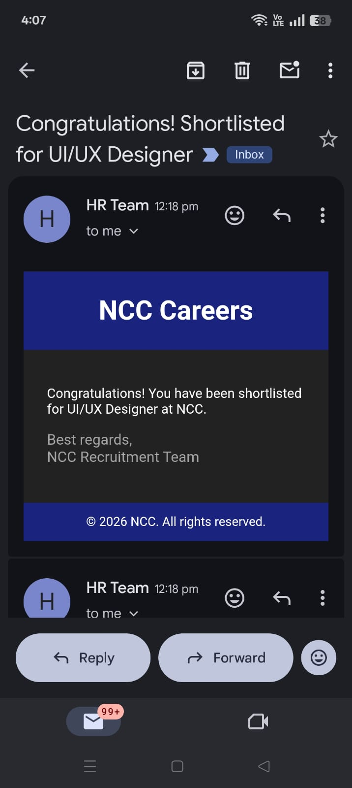

# NCC Careers Task

A streamlined recruitment application designed to manage job submissions and automated candidate communication.

---

## 📧 Email Configuration

The backend uses **Gmail SMTP** to send application confirmations and status updates. To ensure the mailer functions correctly in your development environment, follow these steps:

1.  **Environment Setup**: Clone `.env.example` to a new file named `.env` (this file is ignored by git for security).
2.  **Account Security**: Enable **2-Step Verification** on your Google account.
3.  **Generate App Password**: 
    * Go to your Google Security settings.
    * Create an **"App Password"**.
    * Choose **"Mail"** -> **"Other"**.
4.  **Set Variables**: 
    * Set `EMAIL_USER` to your Gmail address.
    * Set `EMAIL_PASS` to the **16-character app password** (do not use your regular login password).
5.  **Verify**: Restart the backend. The connection is verified on startup; look for `Mail server ready` in the logs.

---

## ⚠️ Important: SMTP Block on Render

> [!CAUTION]  
> **Note on Deployment:** You may notice that emails are not being sent from the live URL. 
> 
> **Reason:** **Render** (the hosting provider) frequently blocks outbound traffic on SMTP ports (25, 465, and 587) to prevent spam abuse. While the code is technically correct and functional in a local environment, Render's network firewall prevents the backend from reaching Google's mail servers.

---

## 📸 Application Preview

Below are screenshots demonstrating the interface and the application flow:

### 1. Main Dashboard


### 2. Application Submission


---

## 🛠️ Development Setup

1. **Install Dependencies**:
   ```bash
   npm install
   ```
2. **Configure Environment**:
Follow the Email Configuration section above.

3. **Run Application:**
  ```bash
   npm run dev
   ```
   
   
